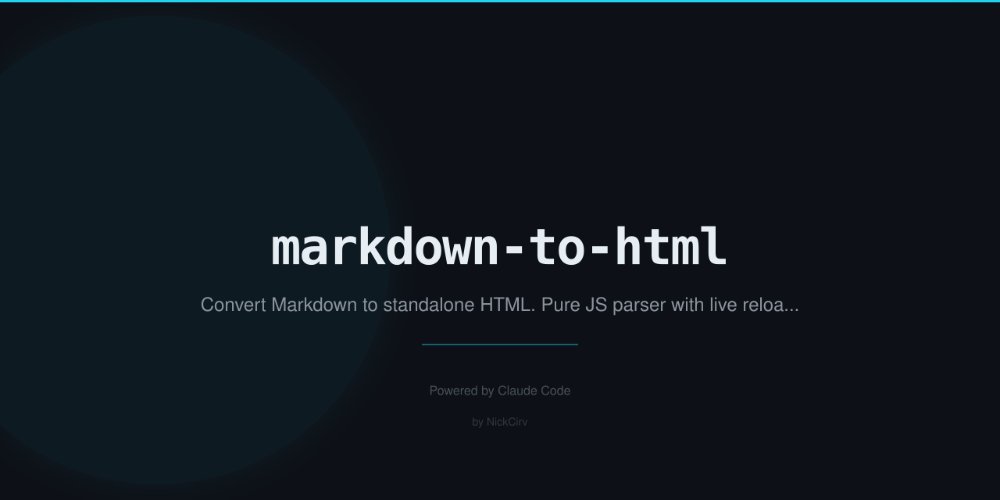

# markdown-to-html

Convert Markdown to beautiful standalone HTML. Pure JS parser, GitHub themes, live reload server. **Zero dependencies** — built-in Node.js modules only.

## Install

```bash
npm install -g markdown-to-html
```

Or run without installing:

```bash
npx markdown-to-html <file.md>
```

## Usage

```bash
md2html <file.md>                        # Convert to HTML, output to stdout
md2html <file.md> -o <file.html>         # Write to file
md2html <directory>                      # Convert all .md files in directory
md2html <file.md> --watch                # Watch and auto-rebuild on change
md2html <file.md> --serve 3000          # Serve with live reload
```

Both `md2html` and `markdown-to-html` are available as commands.

## Options

| Flag | Description |
|------|-------------|
| `-o, --output <file>` | Write output to file instead of stdout |
| `--theme <name>` | Theme: `github` (default), `dark`, `light` |
| `--title <text>` | HTML page title (default: first h1) |
| `--toc` | Generate table of contents |
| `--no-highlight` | Skip language labels on code blocks |
| `--watch` | Watch file and rebuild on change |
| `--serve [port]` | Serve with live reload (default: 3000) |
| `-h, --help` | Show help |
| `-v, --version` | Show version |

## Themes

**`github`** — GitHub-style light theme (default)

**`dark`** — GitHub dark theme

**`light`** — Clean minimal serif theme

## Examples

```bash
# Convert with dark theme and table of contents
md2html README.md --theme dark --toc -o README.html

# Serve with live reload while editing
md2html docs/guide.md --serve 8080

# Watch and rebuild to a file
md2html README.md --watch -o README.html --theme dark

# Convert all .md files in a directory
md2html ./docs
```

## Supported Markdown

- Headings (`#` through `######`, setext style)
- **Bold**, *italic*, ***bold italic***
- ~~Strikethrough~~
- `Inline code`
- Code blocks with optional language label
- Blockquotes
- Ordered and unordered lists (nested up to 3 levels)
- Task lists (`- [ ]` and `- [x]`)
- Links `[text](url)` and `[text](url "title")`
- Auto-links `<https://url>` and `<email@example.com>`
- Images `` and ``
- Horizontal rules (`---`, `***`)
- Tables with column alignment
- Hard line breaks (2 trailing spaces)
- Raw HTML passthrough
- Footnotes (`[^1]` references and `[^1]: definition`)
- Table of contents (via `--toc`)

## Output

Generates fully standalone HTML files with all CSS inlined — no external dependencies, no CDN calls, no JavaScript (except for live reload when using `--serve`).

## Requirements

Node.js >= 18

## License

MIT
